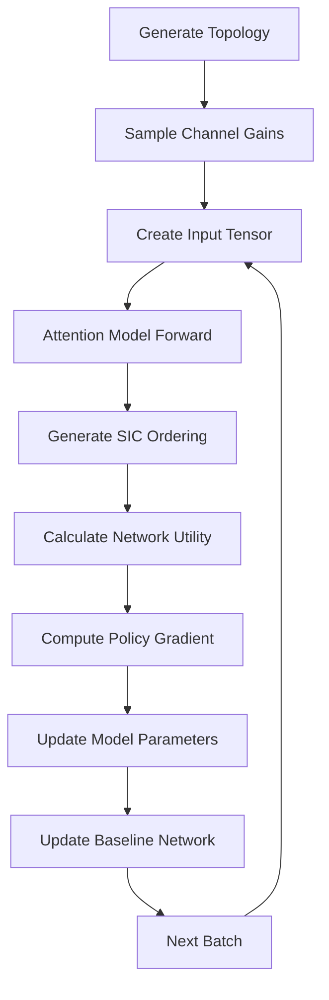
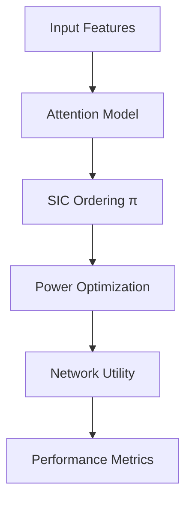

# ASOPA Architecture Documentation

## Table of Contents
- [System Overview](#system-overview)
- [Core Components](#core-components)
- [Data Flow](#data-flow)
- [Neural Network Architecture](#neural-network-architecture)
- [Optimization Framework](#optimization-framework)
- [Training Pipeline](#training-pipeline)
- [Performance Considerations](#performance-considerations)

## System Overview

ASOPA implements a **two-stage optimization approach** for NOMA networks:

```
┌─────────────────┐    ┌──────────────────┐    ┌─────────────────┐    ┌─────────────────┐
│   Input Data    │───▶│ Attention Model  │───▶│ SIC Ordering   │───▶│ Power Allocation│
│                 │    │                  │    │                │    │                 │
│ • Channel gains │    │ • Graph Attention│    │ • Decoding     │    │ • Convex Opt.   │
│ • User weights  │    │ • Sequential     │    │   Order π      │    │ • CVXOPT Solver │
│ • Power limits  │    │   Decoding      │    │                │    │                 │
└─────────────────┘    └──────────────────┘    └─────────────────┘    └─────────────────┘
         │                        │                        │                        │
         ▼                        ▼                        ▼                        ▼
┌─────────────────┐    ┌──────────────────┐    ┌─────────────────┐    ┌─────────────────┐
│ Data Generation │    │ Feature Learning  │    │ Policy Learning │    │ Network Utility │
│                 │    │                  │    │                 │    │                 │
│ • Topology gen  │    │ • Node embedding │    │ • RL Training   │    │ • Weighted PF   │
│ • Channel model │    │ • Graph encoding │    │ • Policy grad.  │    │ • Performance   │
└─────────────────┘    └──────────────────┘    └─────────────────┘    └─────────────────┘
```

### Key Design Principles

1. **Modularity**: Each component can be independently modified or replaced
2. **Scalability**: Supports variable number of users (5-20+)
3. **Efficiency**: Optimized for both training and inference
4. **Extensibility**: Easy to add new attention mechanisms or optimization methods

## Core Components

### 1. Attention Model (`nets/attention_model.py`)

The attention model is the core neural network responsible for determining optimal SIC ordering.

#### Architecture Components

```
Input Features → Embedding Layer → Graph Attention Encoder → Sequential Decoder → SIC Ordering
     ↓                ↓                    ↓                      ↓                ↓
[p_max, w, g] → Linear(3→128) → MultiHeadAttention → PointerNetwork → [π₁, π₂, ..., πₙ]
```

#### Key Features

- **Graph Attention Encoder**: Processes user features with multi-head attention
- **Sequential Decoder**: Generates SIC ordering step-by-step
- **Masking Mechanism**: Ensures valid SIC ordering (no repeated users)
- **Temperature Control**: Balances exploration vs exploitation

#### Implementation Details

```python
class AttentionModel(nn.Module):
    def __init__(self, embedding_dim=128, hidden_dim=128, problem=NOOP, ...):
        # Input embedding
        self.init_embed = nn.Linear(node_dim, embedding_dim)
        
        # Graph attention encoder
        self.embedder = GraphAttentionEncoder(
            n_heads=n_heads,
            embed_dim=embedding_dim,
            n_layers=n_encode_layers
        )
        
        # Attention projections
        self.project_node_embeddings = nn.Linear(embedding_dim, 3 * embedding_dim)
        self.project_fixed_context = nn.Linear(embedding_dim, embedding_dim)
        self.project_step_context = nn.Linear(embedding_dim, embedding_dim)
```

### 2. Graph Attention Encoder (`nets/graph_encoder.py`)

Processes user features using multi-head attention mechanism.

#### Architecture

```
Node Features → Multi-Head Attention → Layer Norm → Feed Forward → Layer Norm → Node Embeddings
     ↓                    ↓                ↓            ↓            ↓              ↓
[batch, n, d] → [batch, n, d] → [batch, n, d] → [batch, n, d] → [batch, n, d] → [batch, n, d]
```

#### Multi-Head Attention

```python
def multi_head_attention(query, key, value, mask=None):
    # Scaled dot-product attention
    scores = torch.matmul(query, key.transpose(-2, -1)) / math.sqrt(d_k)
    if mask is not None:
        scores.masked_fill_(mask == 0, -1e9)
    attention_weights = torch.softmax(scores, dim=-1)
    output = torch.matmul(attention_weights, value)
    return output
```

### 3. Power Allocation Optimizer (`resource_allocation_optimization.py`)

Solves convex optimization for optimal power allocation given SIC ordering.

#### Optimization Formulation

**Objective Function:**
```
maximize Σᵢ wᵢ * f_α(Rᵢ)
subject to:
    Σᵢ pᵢ ≤ P_total
    0 ≤ pᵢ ≤ p_max,i  ∀i
    Rᵢ = log₂(1 + gᵢpᵢ / (σ² + Σⱼ∈SIC(i) gⱼpⱼ))
```

Where:
- `wᵢ`: User weight
- `f_α(Rᵢ)`: Fairness function (α=1 for proportional fairness)
- `gᵢ`: Channel gain
- `pᵢ`: Transmit power
- `SIC(i)`: Users decoded after user i

#### Solution Methods

1. **α = 1 (Proportional Fairness)**:
   - Convex optimization using CVXOPT
   - Interior point method

2. **α ∈ [0,1)**:
   - Successive Convex Approximation (SCA)
   - Iterative optimization

3. **α > 1**:
   - Trivial solution (all power to one user)

### 4. Problem Definition (`problems/noop/`)

Defines the NOMA optimization problem and provides cost calculation.

#### Problem Structure

```python
class NOOP:
    NAME = 'noop'
    
    @staticmethod
    def get_costs(dataset, pi):
        # Extract features
        g = dataset[:, :, -1]  # Channel gains
        w = dataset[:, :, -2]  # User weights
        
        # Apply SIC ordering
        users_order = sort_by_decode_order(users, pi)
        
        # Solve power allocation
        max_throughput = get_max_sum_weighted_alpha_throughput(users_order)
        
        return -max_throughput  # Negative for minimization
```

#### State Management

```python
class StateNOOP(NamedTuple):
    g: torch.Tensor          # Input features
    ids: torch.Tensor        # Batch indices
    first_a: torch.Tensor    # First action
    prev_a: torch.Tensor     # Previous action
    visited_: torch.Tensor   # Visited nodes mask
    i: torch.Tensor          # Current step
```

## Data Flow

### Training Data Flow



### Inference Data Flow



### Detailed Training Steps

1. **Data Generation**:
   ```python
   # Generate user topology
   users = generate_topology(user_num=10)
   
   # Sample channel gains
   g = np.random.exponential(1, size=[batch_size, user_num])
   
   # Create input tensor [p_max, weight, channel_gain]
   input_data = torch.stack([p_max, weights, g], dim=-1)
   ```

2. **Model Forward Pass**:
   ```python
   # Embed input features
   embeddings = model.init_embed(input_data)
   
   # Graph attention encoding
   node_embeddings, graph_embed = model.embedder(embeddings)
   
   # Sequential decoding
   for step in range(user_num):
       logits = model._get_log_p(fixed_context, state)
       selected = model._select_node(logits.exp(), mask)
       state = state.update(selected)
   ```

3. **Cost Calculation**:
   ```python
   # Apply SIC ordering
   users_order = sort_by_decode_order(users, pi)
   
   # Solve power allocation
   optimal_power = get_optimal_p(users_order)
   
   # Calculate network utility
   utility = get_objective_throughput(users_order, optimal_power)
   cost = -utility  # Negative for minimization
   ```

4. **Policy Gradient Update**:
   ```python
   # Compute baseline
   baseline_value = baseline.eval(input_data, cost)
   
   # Policy gradient loss
   advantage = cost - baseline_value
   loss = (advantage * log_likelihood).mean()
   
   # Backward pass
   loss.backward()
   optimizer.step()
   ```

## Neural Network Architecture

### Attention Mechanism Details

#### Multi-Head Attention

```python
def multi_head_attention(query, key, value, n_heads=8):
    batch_size, seq_len, d_model = query.size()
    d_k = d_model // n_heads
    
    # Reshape for multi-head attention
    Q = query.view(batch_size, seq_len, n_heads, d_k).transpose(1, 2)
    K = key.view(batch_size, seq_len, n_heads, d_k).transpose(1, 2)
    V = value.view(batch_size, seq_len, n_heads, d_k).transpose(1, 2)
    
    # Scaled dot-product attention
    scores = torch.matmul(Q, K.transpose(-2, -1)) / math.sqrt(d_k)
    attention_weights = torch.softmax(scores, dim=-1)
    context = torch.matmul(attention_weights, V)
    
    # Concatenate heads
    context = context.transpose(1, 2).contiguous().view(batch_size, seq_len, d_model)
    return context
```

#### Sequential Decoding

```python
def sequential_decode(self, embeddings, state):
    outputs = []
    sequences = []
    
    # Precompute fixed context
    fixed_context = self._precompute(embeddings)
    
    # Sequential decoding
    while not state.all_finished():
        # Get log probabilities
        log_p, mask = self._get_log_p(fixed_context, state)
        
        # Select next node
        selected = self._select_node(log_p.exp(), mask)
        
        # Update state
        state = state.update(selected)
        
        # Store outputs
        outputs.append(log_p)
        sequences.append(selected)
    
    return torch.stack(outputs, 1), torch.stack(sequences, 1)
```

### Graph Attention Encoder Architecture

```
Input: [batch_size, n_users, 3]  # [p_max, weight, channel_gain]
  ↓
Linear Embedding: [batch_size, n_users, embedding_dim]
  ↓
Multi-Head Attention Layers (n_layers):
  ├── Multi-Head Attention
  ├── Layer Normalization
  ├── Feed Forward Network
  └── Layer Normalization
  ↓
Output: [batch_size, n_users, embedding_dim]
```

## Optimization Framework

### Convex Optimization Formulation

#### Problem Setup

For α = 1 (proportional fairness):

```
maximize Σᵢ wᵢ * log(Rᵢ)
subject to:
    Rᵢ = log₂(1 + gᵢpᵢ / (σ² + Σⱼ∈SIC(i) gⱼpⱼ))
    0 ≤ pᵢ ≤ p_max,i  ∀i
```

#### CVXOPT Implementation

```python
def solve_convex_optimization(users, noise):
    # Define objective function
    def objective(x):
        # x = [log(p₁), log(p₂), ..., log(pₙ)]
        p = np.exp(x)
        throughput = calculate_throughput(users, p, noise)
        return -np.sum(throughput)  # Minimize negative
    
    # Define constraints
    def constraints(x):
        # Power constraints: 0 ≤ pᵢ ≤ p_max,i
        p = np.exp(x)
        return np.concatenate([p, p_max - p])
    
    # Solve using CVXOPT
    result = solvers.cp(objective, constraints)
    return np.exp(result['x'])
```

### Successive Convex Approximation (SCA)

For α ∈ [0,1):

```python
def sca_optimization(users, alpha, noise):
    # Initialize
    p_current = np.zeros(len(users))
    
    # Iterative optimization
    for iteration in range(max_iterations):
        # Linearize objective around current point
        linearized_obj = linearize_objective(users, p_current, alpha)
        
        # Solve convex subproblem
        p_new = solve_convex_subproblem(linearized_obj, users)
        
        # Check convergence
        if np.linalg.norm(p_new - p_current) < tolerance:
            break
        
        p_current = p_new
    
    return p_current
```

## Training Pipeline

### Policy Gradient Training

#### REINFORCE Algorithm

```python
def policy_gradient_loss(model, batch, baseline):
    # Forward pass
    cost, log_likelihood = model(batch)
    
    # Compute baseline
    baseline_value = baseline.eval(batch, cost)
    
    # Policy gradient loss
    advantage = cost - baseline_value
    loss = (advantage * log_likelihood).mean()
    
    return loss
```

#### Baseline Network

```python
class RolloutBaseline:
    def __init__(self, model, problem, opts):
        self.model = model
        self.problem = problem
        self.opts = opts
    
    def eval(self, batch, cost):
        # Rollout baseline: use current model for baseline
        with torch.no_grad():
            baseline_cost, _ = self.model(batch)
        return baseline_cost
```

### Curriculum Learning

```python
def curriculum_learning(epoch, total_epochs):
    # Gradually increase problem complexity
    if epoch < total_epochs * 0.3:
        user_range = (5, 7)      # Easy problems
    elif epoch < total_epochs * 0.6:
        user_range = (7, 9)      # Medium problems
    else:
        user_range = (9, 10)     # Hard problems
    
    return user_range
```

## Performance Considerations

### Memory Optimization

1. **Gradient Checkpointing**:
   ```python
   if self.checkpoint_encoder and self.training:
       embeddings, _ = checkpoint(self.embedder, self._init_embed(input))
   ```

2. **Batch Shrinking**:
   ```python
   if self.shrink_size is not None and len(unfinished) <= self.shrink_size:
       # Shrink batch to save memory
       state = state.filter(unfinished)
   ```

3. **Mixed Precision Training**:
   ```python
   from torch.cuda.amp import autocast, GradScaler
   
   scaler = GradScaler()
   with autocast():
       loss = model(batch)
   scaler.scale(loss).backward()
   scaler.step(optimizer)
   ```

### Computational Optimization

1. **Vectorized Operations**:
   ```python
   # Efficient batch processing
   all_logits = torch.stack([model._get_log_p(fixed, state) for state in states])
   ```

2. **Caching**:
   ```python
   # Cache expensive computations
   @lru_cache(maxsize=1000)
   def cached_power_optimization(user_features):
       return solve_power_allocation(user_features)
   ```

3. **Parallel Processing**:
   ```python
   # Multi-GPU training
   if torch.cuda.device_count() > 1:
       model = torch.nn.DataParallel(model)
   ```

### Scalability Considerations

1. **Variable User Numbers**:
   - Padding for fixed-size batches
   - Dynamic masking for valid users
   - Curriculum learning for different problem sizes

2. **Large-Scale Training**:
   - Distributed training support
   - Gradient accumulation for large batches
   - Model parallelism for large models

3. **Inference Optimization**:
   - Model quantization
   - TensorRT optimization
   - Batch inference optimization

---

## Extension Points

### Adding New Attention Mechanisms

1. **Create new attention module**:
   ```python
   class MyAttentionModel(nn.Module):
       def __init__(self, ...):
           # Your implementation
       
       def forward(self, input, return_pi=False):
           # Your forward pass
   ```

2. **Register in model factory**:
   ```python
   model_class = {
       'attention': AttentionModel,
       'my_attention': MyAttentionModel,
       'pointer': PointerNetwork
   }.get(opts.model, AttentionModel)
   ```

### Adding New Optimization Methods

1. **Implement new solver**:
   ```python
   def my_power_optimization(users, alpha, noise):
       # Your optimization method
       return optimal_power
   ```

2. **Integrate with existing framework**:
   ```python
   def get_optimal_p(users, alpha, noise, solver='cvxopt'):
       if solver == 'my_method':
           return my_power_optimization(users, alpha, noise)
       else:
           return existing_optimization(users, alpha, noise)
   ```

### Adding New Baseline Methods

1. **Implement baseline**:
   ```python
   def my_baseline_method(users, alpha, noise):
       # Your baseline implementation
       return decode_order, max_throughput
   ```

2. **Add to comparison suite**:
   ```python
   baseline_methods = {
       'exhaustive': duibi_exhaustive_search,
       'heuristic': duibi_heuristic_method_qian,
       'my_method': my_baseline_method
   }
   ```